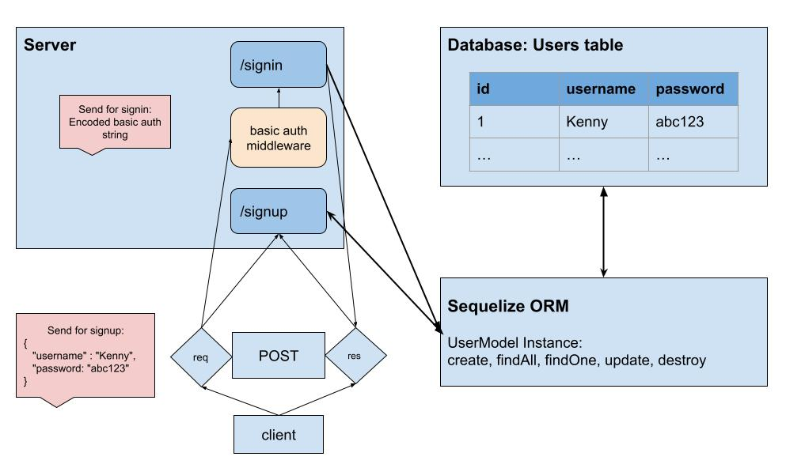

# LAB - Class 06

## Project: Authentication

### Author: Kenny W. Lino

### Problem Domain  

This application serves as an example for how to add authentication to an Express backend. To do this, we use Bcrypt to encrypt our passwords.

### Links and Resources

- [ci/cd](https://github.com/kennywlino/basic-auth/actions)
- [back-end server (production)](https://basic-auth-hnix.onrender.com)
- [Main PR from dev](https://github.com/kennywlino/basic-auth/pull/1)

### Setup

#### `.env` requirements (where applicable)

i.e.

- `PORT` - Port Number
- `DATABASE_URL` - location of Postgres DB (i.e. postgres://localhost:5432/api-app?sslmode=disable)

#### How to initialize/run your application

- nodemon

#### How to use your library (where applicable)

#### Features / Routes

- GET : `/` - default route to hit for proof of life
- POST: `/signin` - route to signin with given user and password
- POST: `/signup` - route to signup with given user and password

#### Tests

- How do you run tests?
  - npm test

- Any tests of note?

    No tests as of now.

#### UML

